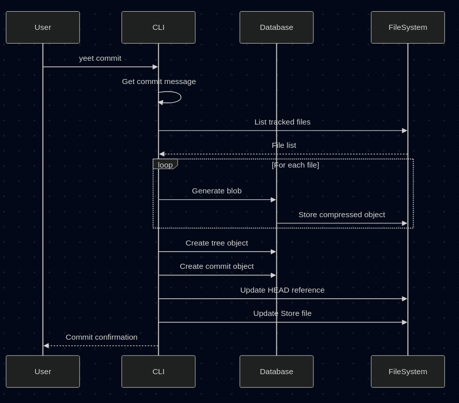
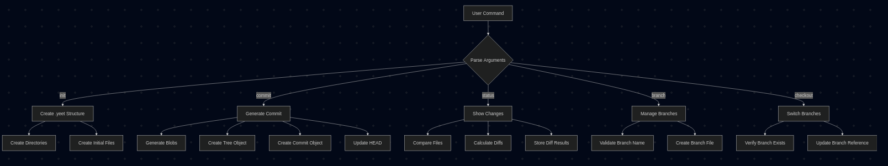
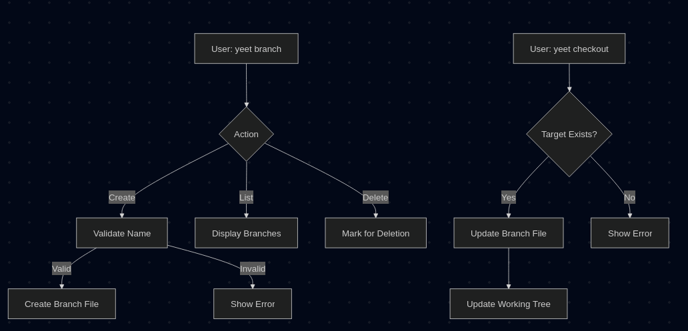
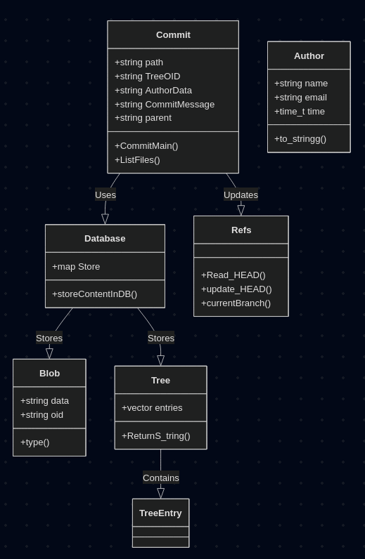

### Notice: 
This has not been fully tested on Windows yet, so if you are using Windows and have found some issues, please give me feedback. :)
I am using the filesystem library to make it cross-platform.

# Introduction:
- This is a project to make my own version control with some improvements.
- Through this, I also want to learn the backend of version control and make my grasp stronger on C++.
- I am trying to solve some of my personal problems and gain an understanding of the Computer filesystem and its management.

## HOW TO USE IN LINUX/UNIX ENVIRONMENT
1. Clone/Download this repository.
2. Open the terminal and navigate to this directory.
3. Run the following command:
```bash
 g++ main.cpp controllers.cpp -std=c++17 -lcryptopp -lz -o yeet
```
4. Set the permissions for the executable file:
```bash
chmod a+x yeet
```
5. Set the environment variable:
```bash
export PATH=$PATH:/path/to/yeet/repo/
```
6. Run the executable file and initialize an empty yeet repo:
```bash
yeet init .
```
## Make Sure:
you have lcryptopp installed in your system. I am using fedora and I installed it using:
```bash 
sudo dnf install cryptopp-devel
```
Search according to your OS.

## CAREFUL
- For now, You can only make git init in the pwd, You can not do git init /home/abc/some/folder. This will not work. It will be executed but will give rise to complications. If you want to init in a folder, you have to cd to that folder and then run the command. 
- You can only yeet init in a already made directory. You can not yeet init in a directory that does not exist.
- There is no option to base/rebase for the branch/checkout command

## Workflow diagrams:
The below are very minimal and abstracted view of the working of the project. You have to go throught the code to learn the details of the implementation.
1. 
2. 
3. 
4. 


## Testing The compression:
Use the Testing_inflating.cpp file as follow for decompressing your blob data: 
```bash
g++ -lz Testing_Inflating.cpp -o Testing_inflate && ./Testing_inflate
```

You can also use the following command:
```bash 
zlib-flate -uncompress < .yeet/objects/5d/8d5a1314ec0f6a5b7f8ac27dfbf53ed82bf3fe > test-abc
```

## Main Compilation Command:

```bash
g++ main.cpp controllers.cpp -std=c++17 -lcryptopp -lz -o yeet
```

## FOR BETTER DEBUGGING:
```bash
g++ main.cpp controllers.cpp -std=c++17 -lcryptopp -lz -fdiagnostics-all-candidates
```

## COMMENTS/TODOs:
- For now, I am leaving the locks and while writting and reading file. It might cause error at some cases.
- No structure Error handling for now.
- Temparary Path approach for storing objects will do it later.
- Back traversal for full history tree, will work on it next.
- More robust Testing is needed. (Trying to implement it using GoogleTests.)

## Branch:
[x] Branch Creation
[x] Current Branch storage
[x] Changing Branches (Checkout)
[x] See all branches with commit ids
[x] Commits on the active branch.
[ ] Option to choose which branch I want to make my new branch from. (Currently the new branch will automatically start from the prev branch ie the branch you were in)

## Checkout:
[ ]logic to reset the working directory to the target branch’s commit using tree traversal.

## Commit:
[ ] Commits should check the diifs function output to check what are the files in which changes are made. (Find solution of the problem: what if branches are changed? then how to this?)

## Status:
[x] Status function is not working at edge cases. (Not parsing exec was the problem)
[ ] Design a new file structure `.diff` to store the diffs content